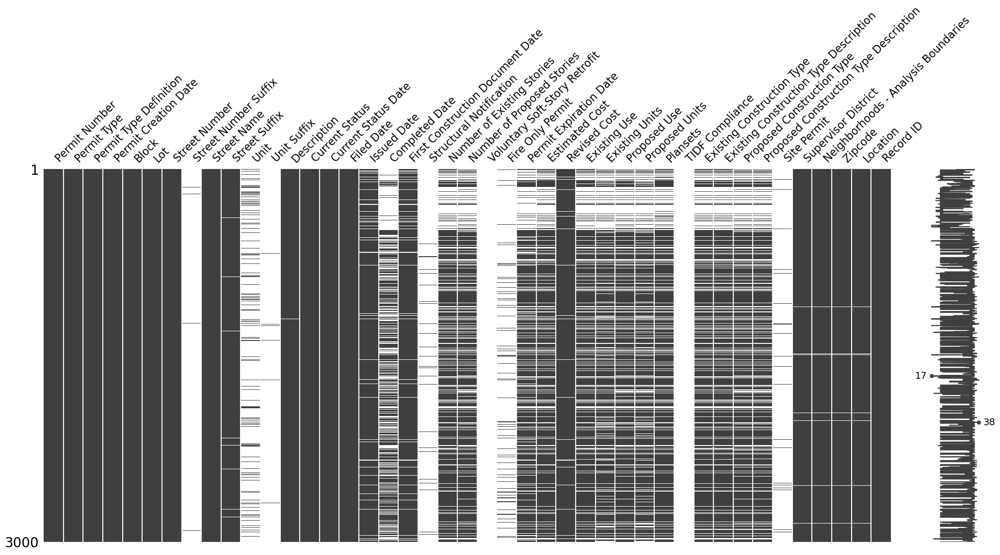
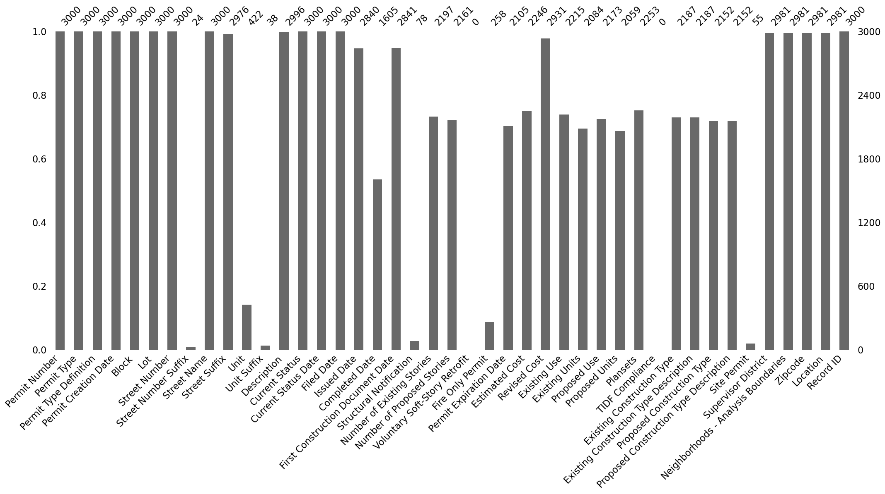
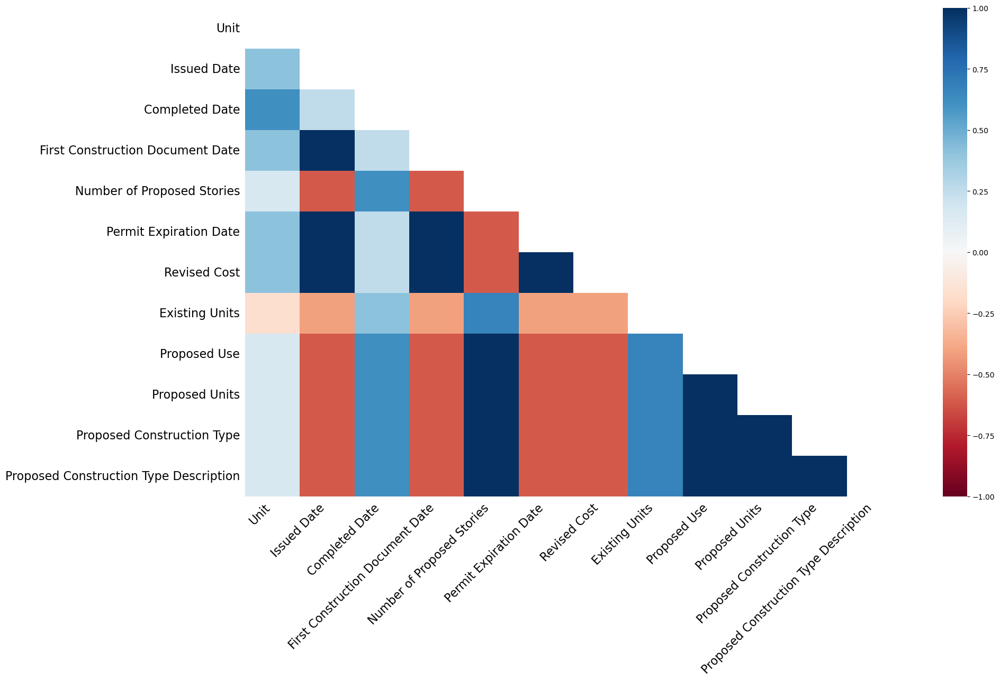
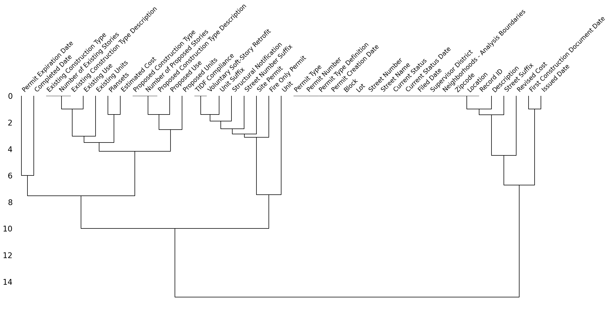

```python
import numpy as np
import pandas as pd
import matplotlib as plt
import seaborn as sns
```


```python
sf_permits = pd.read_csv("./Building_Permits.csv")

sf_permits.head()
```

    /tmp/ipykernel_50336/2707110962.py:1: DtypeWarning: Columns (22,32) have mixed types. Specify dtype option on import or set low_memory=False.
      sf_permits = pd.read_csv("./Building_Permits.csv")


<div>
<style scoped>
    .dataframe tbody tr th:only-of-type {
        vertical-align: middle;
    }

    .dataframe tbody tr th {
        vertical-align: top;
    }

    .dataframe thead th {
        text-align: right;
    }
</style>
<table border="1" class="dataframe">
  <thead>
    <tr style="text-align: right;">
      <th></th>
      <th>Permit Number</th>
      <th>Permit Type</th>
      <th>Permit Type Definition</th>
      <th>Permit Creation Date</th>
      <th>Block</th>
      <th>Lot</th>
      <th>Street Number</th>
      <th>Street Number Suffix</th>
      <th>Street Name</th>
      <th>Street Suffix</th>
      <th>...</th>
      <th>Existing Construction Type</th>
      <th>Existing Construction Type Description</th>
      <th>Proposed Construction Type</th>
      <th>Proposed Construction Type Description</th>
      <th>Site Permit</th>
      <th>Supervisor District</th>
      <th>Neighborhoods - Analysis Boundaries</th>
      <th>Zipcode</th>
      <th>Location</th>
      <th>Record ID</th>
    </tr>
  </thead>
  <tbody>
    <tr>
      <th>0</th>
      <td>201505065519</td>
      <td>4</td>
      <td>sign - erect</td>
      <td>05/06/2015</td>
      <td>0326</td>
      <td>023</td>
      <td>140</td>
      <td>NaN</td>
      <td>Ellis</td>
      <td>St</td>
      <td>...</td>
      <td>3.0</td>
      <td>constr type 3</td>
      <td>NaN</td>
      <td>NaN</td>
      <td>NaN</td>
      <td>3.0</td>
      <td>Tenderloin</td>
      <td>94102.0</td>
      <td>(37.785719256680785, -122.40852313194863)</td>
      <td>1380611233945</td>
    </tr>
    <tr>
      <th>1</th>
      <td>201604195146</td>
      <td>4</td>
      <td>sign - erect</td>
      <td>04/19/2016</td>
      <td>0306</td>
      <td>007</td>
      <td>440</td>
      <td>NaN</td>
      <td>Geary</td>
      <td>St</td>
      <td>...</td>
      <td>3.0</td>
      <td>constr type 3</td>
      <td>NaN</td>
      <td>NaN</td>
      <td>NaN</td>
      <td>3.0</td>
      <td>Tenderloin</td>
      <td>94102.0</td>
      <td>(37.78733980600732, -122.41063199757738)</td>
      <td>1420164406718</td>
    </tr>
    <tr>
      <th>2</th>
      <td>201605278609</td>
      <td>3</td>
      <td>additions alterations or repairs</td>
      <td>05/27/2016</td>
      <td>0595</td>
      <td>203</td>
      <td>1647</td>
      <td>NaN</td>
      <td>Pacific</td>
      <td>Av</td>
      <td>...</td>
      <td>1.0</td>
      <td>constr type 1</td>
      <td>1.0</td>
      <td>constr type 1</td>
      <td>NaN</td>
      <td>3.0</td>
      <td>Russian Hill</td>
      <td>94109.0</td>
      <td>(37.7946573324287, -122.42232562979227)</td>
      <td>1424856504716</td>
    </tr>
    <tr>
      <th>3</th>
      <td>201611072166</td>
      <td>8</td>
      <td>otc alterations permit</td>
      <td>11/07/2016</td>
      <td>0156</td>
      <td>011</td>
      <td>1230</td>
      <td>NaN</td>
      <td>Pacific</td>
      <td>Av</td>
      <td>...</td>
      <td>5.0</td>
      <td>wood frame (5)</td>
      <td>5.0</td>
      <td>wood frame (5)</td>
      <td>NaN</td>
      <td>3.0</td>
      <td>Nob Hill</td>
      <td>94109.0</td>
      <td>(37.79595867909168, -122.41557405519474)</td>
      <td>1443574295566</td>
    </tr>
    <tr>
      <th>4</th>
      <td>201611283529</td>
      <td>6</td>
      <td>demolitions</td>
      <td>11/28/2016</td>
      <td>0342</td>
      <td>001</td>
      <td>950</td>
      <td>NaN</td>
      <td>Market</td>
      <td>St</td>
      <td>...</td>
      <td>3.0</td>
      <td>constr type 3</td>
      <td>NaN</td>
      <td>NaN</td>
      <td>NaN</td>
      <td>6.0</td>
      <td>Tenderloin</td>
      <td>94102.0</td>
      <td>(37.78315261897309, -122.40950883997789)</td>
      <td>144548169992</td>
    </tr>
  </tbody>
</table>
<p>5 rows × 43 columns</p>
</div>


```python
## if you don't have the library you need to install it
## import sys
## !{sys.executable} -m pip install missingno
```


```python
import missingno as msno
```


```python
msno.matrix(sf_permits.head(3000))
```


    <Axes: >


    

    


```python
msno.bar(sf_permits.head(3000))
```


    <Axes: >


    

    


```python
msno.heatmap(sf_permits.head())
```

    /opt/anaconda3/lib/python3.11/site-packages/seaborn/matrix.py:260: FutureWarning: Format strings passed to MaskedConstant are ignored, but in future may error or produce different behavior
      annotation = ("{:" + self.fmt + "}").format(val)


    ---------------------------------------------------------------------------

    ValueError                                Traceback (most recent call last)

    Cell In[15], line 1
    ----> 1 msno.heatmap(sf_permits.head())


    File /opt/anaconda3/lib/python3.11/site-packages/missingno/missingno.py:398, in heatmap(df, filter, n, p, sort, figsize, fontsize, labels, label_rotation, cmap, vmin, vmax, cbar, ax)
        395 ax0.patch.set_visible(False)
        397 for text in ax0.texts:
    --> 398     t = float(text.get_text())
        399     if 0.95 <= t < 1:
        400         text.set_text('<1')


    ValueError: could not convert string to float: '--'


    

    


```python
msno.dendrogram(sf_permits.head(300))
```


    <Axes: >


    

    


```python

```
